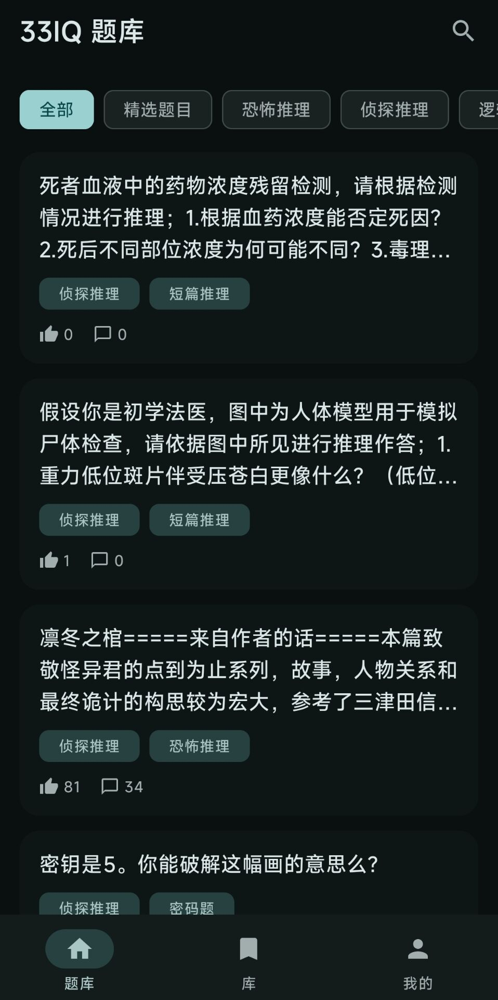
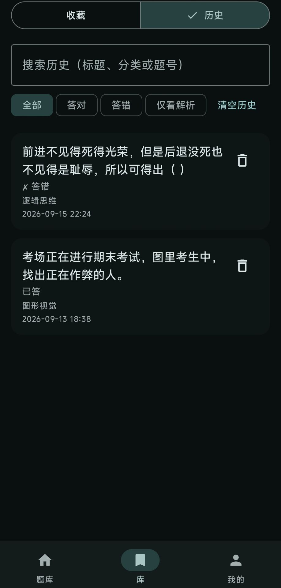

# 🧩 33IQ Next

[简体中文](README.md) | **English**

[](https://kotlinlang.org)
[](https://developer.android.com/studio/releases/gradle-plugin)
[](https://gradle.org)

An **unofficial, third-party Android client** for [33IQ](https://www.33iq.com) — a Chinese "thinking training" / riddle community (智力题库). **Built for personal learning and technical research only.**

33IQ has no public, documented third-party API. This app talks to the same server-rendered pages a mobile browser would get (parsed with [Jsoup](https://jsoup.org/)) and to a handful of JSON endpoints the official Android app itself uses. The approach and its limits are documented below and in code comments so it stays visible what was actually verified and what is best-effort.

> **Disclaimer**: This project is not affiliated with, endorsed by, or connected to 33IQ in any way. Question content, images and account data all belong to 33IQ and its users/authors. Do not use this app to scrape at scale, bypass paywalls, or redistribute content — see [Project Scope & Limitations](#project-scope--limitations).

## Table of Contents

- [Screenshots](#screenshots)
- [Application Scope](#application-scope)
- [How data is obtained](#how-data-is-obtained)
- [Confirmed vs. best-effort](#confirmed-vs-best-effort)
- [Tech Stack](#tech-stack)
- [Architecture](#architecture)
- [Gradle Config](#gradle-config)
- [Code Verification](#code-verification)
- [Project Scope & Limitations](#project-scope--limitations)
- [Getting Started](#getting-started)
- [Building and signing](#building-and-signing)
- [Roadmap](#roadmap)
- [Credits](#credits)
- [License](#license)

## Screenshots

| Question feed | Library · history |
|---|---|
|  |  |

## Application Scope

- **Question feed** — browse questions by category (detective / logic / lateral thinking / trivia / …) with infinite scroll
- **Search** — keyword search against 33IQ's own search page
- **Question detail** — title, tags, author, stats, multiple-choice options (where present), analysis, comment count
- **Answering** — submit a choice or open answer for real server-side scoring (correct/wrong and the 学识 delta are both server-reported)
- **Hints & analysis** — follows 33IQ's own paid flow: quote → explicit confirmation → payment when required → reveal
- **Word-bank questions** — tile-based answering when the server supplies a candidate character bank
- **Favourites & history** — fully local (Room) bookmark list and answer history, filterable by correct/wrong/analysis-only, usable without logging in
- **Login** — logs in through 33IQ's own endpoint; the session cookie is persisted across restarts
- **Daily check-in** — with a verified session, claims the daily check-in on launch (once per Asia/Shanghai calendar day)
- **Settings** — session/account status, light/dark/system theme, open-source licenses, disclaimer

## How data is obtained

33IQ does not publish a documented API for third-party clients. This app started from inspecting the **public, server-rendered HTML** of the site (page source, embedded scripts and the site's own AJAX calls). It was later upgraded using a privacy-scrubbed capture of the official 33IQ Android app's own traffic, contributed by a maintainer. That capture confirmed a detail neither pure HTML inspection nor guessing could have found: **the same URL** the website serves as HTML returns a much richer plain **JSON** payload when the request carries the right query parameter.

Out of respect for 33IQ, this README no longer lists concrete endpoints or field names — those live in the code and its comments. Two site-specific quirks are worth calling out, because the client handles them explicitly:

- The site's HTML is served as **GBK**, not UTF-8; the network layer encodes requests and decodes responses in the charset each path actually uses.
- Requests that look automated can be redirected to a login wall — the client detects this and raises a typed error instead of silently mis-parsing a login page as content.

The capture was a **structure-only** analysis package (request/response shapes and field *names*, without header or body *values*), so capabilities visible in it but unused by current features are tracked in the [Roadmap](#roadmap) rather than wired in. The data layer sits behind repository interfaces, so a more precise implementation can replace it without touching the UI.

## Confirmed vs. best-effort

To stay honest about reliability:

| Capability | Status |
|---|---|
| Browsing questions, tags, search | ✅ Verified against live responses |
| Question detail (title/tags/author/choices/upvotes/comment & collect counts/right-ratio) | ✅ Real JSON endpoint and field names confirmed from a captured app session, re-verified live |
| Login fields and success response | ✅ Confirmed from a real, successful captured login |
| Login failure detection | ⚠️ No failed login was ever captured, so error status values remain unconfirmed guesses; a login whose state cannot be verified is reported as *not verified*, never as success |
| Submitting an answer | ✅ Confirmed live for choice questions: correct / wrong / already-answered are distinct real responses with a real 学识 delta. Open-ended submission is still unconfirmed |
| Viewing analysis | ✅ Implemented as an independent quote → confirmation → payment-if-needed → reveal flow; text and images render natively. ⚠️ Automated tests use mocks; no live purchases were made during verification |
| Hint price + reveal | ✅ Confirmed live, including 33IQ's own normal/member/lifetime-member price breakdown, shown as-is rather than recomputed client-side |
| Comments on a question | ❌ Not loaded. No comments-list endpoint appeared in the capture, so the UI shows only the comment *count* and says so |
| Word-bank questions | ✅ Confirmed by an anonymous fetch; candidate tiles preserve server order and duplicates, and incomplete metadata disables submission instead of falling back to free typing |
| Answered markers / hide answered | ✅ Confirmed correct/wrong/repeat results and the separate "analysis viewed" restriction are persisted locally per account. ⚠️ No server history source is confirmed, so older answers and answers made elsewhere are **unknown**, not confirmed unanswered |
| Pagination | ⚠️ Prefers the list's own next links and falls back to the legacy page-number protocol; empty or duplicate-only pages stop paging. Fresh live verification is still blocked by the site's security challenge |
| Server-side favouriting | ❌ Not implemented — no server-side favourite endpoint appeared in the capture. Favourites are a genuine, fully working **local** bookmark list instead |
| Search | ⚠️ HTML scraping only; late in development this path started returning a login-wall/anti-bot response to repeated automated requests, so it is untested against a fresh session and stays best-effort |
| Daily check-in | ⚠️ URLs and fields confirmed from a captured session that only asserted HTTP 200; success strings are unconfirmed, so a non-error reply is treated as done, at most once per Asia/Shanghai calendar day |

### Feed refresh and local progress

- Pull-to-refresh reloads the first page; reopening or switching category also starts at the first page; returning from the background does not automatically replace the list.
- Scrolling appends pages using the site's next links and deduplicates only against the current list. Visible progress resets the automatic scan budget, so normal scrolling is not capped at a fixed page count; duplicate-only or fully hidden scans stay bounded and offer a continue action.
- The hide-answered/viewed-analysis switch is a persistent device preference. Hidden cards are retained in the current batch, so switching it off shows them again.
- Correct, wrong and repeated submissions all confirm an answered ID. "Analysis viewed" is a **separate** restriction (viewing the analysis disqualifies answering); both can coexist. Network errors, unrecognised replies and answer limits confirm neither. Only IDs and preferences are stored locally — never submitted answer text.
- Verified logins use the server UID for account isolation. Sessions without a UID get a persistent opaque namespace that a later login will not silently merge into an account. Web/other-device/older-version history is not imported; a missing local record is labelled unknown in detail.

### Viewing analysis safely

- Hints and analysis are separate actions; opening or cancelling the price dialog neither pays nor fetches the answer. Even a zero-cost quote requires confirmation, because viewing can disqualify answering and affect wrong-answer statistics.
- The quoted price is displayed as-is, never hardcoded or recomputed from membership status. The quote is re-checked before payment; changed terms require fresh confirmation.
- A pending flag is synchronously persisted per account/question **before** any payment or reveal request. Timeouts, malformed replies and cancellation keep it, including across process restart. Recovery only re-requests the reveal, never the payment call; an unresolved recovery points the user to the website instead of offering another purchase.
- Paid request bodies are one-shot with transport retries and redirects disabled, preventing transparent POST replay; a repository-level lock plus ViewModel guards prevent overlapping confirmations and competing answer/hint flows.

## Tech Stack

**Core:**
- **[Kotlin 2.x](https://kotlinlang.org/)** — Coroutines, Flow, KSP, Serialization
- **[Jsoup](https://jsoup.org/)** — HTML parsing (no public API exists; official-app JSON endpoints are used only where confirmed)

**Android Jetpack:**
- **[Compose](https://developer.android.com/jetpack/compose)** + **[Navigation Compose](https://developer.android.com/jetpack/compose/navigation)** (type-safe routes)
- **[ViewModel](https://developer.android.com/topic/libraries/architecture/viewmodel)**, **[Room](https://developer.android.com/jetpack/androidx/releases/room)** (local favourites & history), Core Splashscreen

**Networking & images:**
- **[OkHttp](https://square.github.io/okhttp/)** — HTTP client with a persistent cookie jar for session persistence
- **[Coil 3](https://github.com/coil-kt/coil)** — image loading over the same OkHttp stack

**Dependency injection:** **[Koin](https://insert-koin.io/)**

**Architecture:** Clean Architecture (per-module Presentation/Domain/Data layers) + Single Activity + MVVM/MVI

**Code quality:** Konsist (architecture/convention tests), Ktlint, Detekt, Spotless

## Architecture

The project keeps the modular Clean Architecture skeleton this fork is built on (originally [android-showcase](https://github.com/igorwojda/android-showcase)), re-pointed at 33IQ instead of a music API.

### Module types and dependencies

- **`app`** — navigation graph, DI wiring, theme
- **`feature-feed`** — question list / search / detail
- **`feature-favourite`** — local bookmarks and history (Room)
- **`feature-auth`** — login screen
- **`feature-settings`** — theme, session/account, licenses, disclaimer
- **`feature-base`** — shared `BaseViewModel`/`Result`/composables used by every feature
- **`library-network`** — the 33IQ HTTP/scraping layer (charset-aware client, cookie persistence, session management, daily check-in)
- **`library-test-utils`** — shared test utilities

```
feature-feed ──▶ feature-favourite
     │                  │
     ├──▶ library-network            (feature-settings, feature-auth also depend on this)
     └──▶ feature-base ◀── (every feature module)
app ──▶ feature-feed, feature-favourite, feature-auth, feature-settings, library-network
```

### Feature module structure

**Presentation layer** — `MVVM` + `MVI`: a ViewModel exposes a single Flow of immutable UI state, and `Action` objects reduce the current state into the next one. Composable screens only render state and forward user intent.

**Domain layer** — independent of Data/Presentation. `UseCase`s hold business logic; `Repository` interfaces keep the domain decoupled from *how* data is fetched.

**Data layer** — in `feature-feed`, lists and search come from HTML parsing while question detail comes from the app-facing JSON; the remote data source builds the right request for each and moves parsing off the caller's thread. `feature-favourite` uses a local Room database.

### `library/network`

Everything specific to talking to `www.33iq.com` lives here, isolated from the UI: a charset-aware HTTP client with login-wall detection, a cookie jar that survives app restarts, and the single source of truth for "am I logged in" — session state is classified as authenticated, guest or unknown from the site's own guest probe (an HTTP 200, or merely holding cookies, is never taken as proof), and a probe that cannot complete leaves the last verified state untouched.

## Gradle Config

- **Dependency management** — a Gradle [version catalog](gradle/libs.versions.toml) centralizes versions across all modules.
- **Convention plugins** — [convention plugins](build-logic/src/main/kotlin/com/jiugjk/iq33/buildlogic) standardize build configuration (`application`, `feature`, `library`, `kotlin`, `test`, `detekt`, `spotless`, …) so each module's `build.gradle.kts` stays minimal.
- **Type-safe project accessors:**

```kotlin
implementation(projects.feature.feed)
implementation(projects.library.network)
```

## Code Verification

```bash
./gradlew konsist-test:test --rerun-tasks           # Architecture & convention validation
./gradlew lintDebug                                 # Android lint analysis
./gradlew detektCheck                               # Code complexity & style analysis
./gradlew spotlessCheck                             # Code formatting verification
./gradlew testDebugUnitTest -x konsist-test:test    # Unit test execution
./gradlew :app:bundleDebug                          # Production build verification
```

> **Note**: an Android SDK + JDK 17 toolchain is installed in the development environment and every command above (plus `:app:assembleDebug`) was run for real, with each compile/lint/detekt/format failure fixed in place. The template's "every class must have a matching unit test" Konsist gates were removed, since this fork intentionally does not keep 1:1 coverage — see the comments in those files. CI (`.github/workflows/check.yml`) runs the same checks on every push.

## Project Scope & Limitations

- **Not affiliated with 33IQ.** This is a personal-learning reverse-engineering exercise, not a redistribution or commercial product.
- **No public API existed to build against.** The data layer parses 33IQ's own public pages; see the table above for what was verified vs. guessed.
- **Paid content spends real 学识 on your real account.** Revealing an answer or hint calls 33IQ's own paid endpoints and really deducts from whatever account is logged in — this client does not bypass that currency, it just gives the official paid actions a UI.
- **Be respectful of 33IQ's servers** — this client makes the same kind of requests a mobile browser would; don't modify it to hammer the site or scrape at scale.

## Getting Started

**Prerequisites:** Android Studio, JDK 17+, Android SDK (compileSdk 36).

```bash
git clone https://github.com/jiugjk/33IQ-Next.git
# Open in Android Studio: File -> Open -> select the cloned directory
```

No API key or config is required to browse — the app talks straight to `https://www.33iq.com`. Logging in uses your real 33IQ credentials, sent directly to 33iq.com's own server (see the in-app disclaimer on the login screen).

## Building and signing

Both CI workflows (`build.yml`, run manually or on a feature branch, and `check.yml`, run on pull requests and pushes to `main`) build **both** variants — `:app:assembleDebug` and `:app:assembleRelease` — and upload each APK as an artifact. Building release every run keeps R8 and resource shrinking, which only apply to that build type, continuously checked.

Signing material is read from the environment and is never stored in this repository. Configure these four repository secrets to have CI sign what it builds:

| Secret | Contents |
|---|---|
| `SIGNING_KEYSTORE_BASE64` | The keystore itself, base64-encoded (`base64 -w0 upload-keystore.jks`) |
| `SIGNING_KEYSTORE_PASSWORD` | Keystore password |
| `SIGNING_KEY_ALIAS` | Key alias inside the keystore |
| `SIGNING_KEY_PASSWORD` | Password for that key |

The workflow decodes the keystore into the runner's temp directory for the length of the job. Both build types use that one key, so successive CI builds install over each other instead of being rejected for a mismatched signature.

Nothing fails when the secrets are absent — a fork's pull request (GitHub withholds secrets from those) or a fresh clone still builds: debug keeps the throwaway key AGP generates and release comes out as `app-release-unsigned.apk`.

Locally, the same four values can go in `~/.gradle/gradle.properties` as `signingKeystoreFile`, `signingKeystorePassword`, `signingKeyAlias` and `signingKeyPassword` (a path, not base64), or be exported as `SIGNING_KEYSTORE_FILE`, `SIGNING_KEYSTORE_PASSWORD`, `SIGNING_KEY_ALIAS` and `SIGNING_KEY_PASSWORD`.

## Roadmap

- Verify server-side favouriting and comment posting/listing against a live account and wire them behind the existing repository interfaces
- Re-verify pagination against a working live session: advertised same-list links win, unusable pagination falls back to the legacy page-number protocol, duplicate-only responses stop further requests
- Confirm a read-only historical answer-status source to complement local answered markers
- Wire up capabilities seen in the captures but unused by any feature yet (notification counts, check-in history, follow-feed updates)
- Confirm the login endpoint's error statuses (only successful logins were ever captured) and surface the account's 学识 balance
- Verify analysis viewing on-device with the user's explicit consent; never assume a correct answer or past viewing implies a zero price — always use the server quote
- Confirm answer submission for open-ended (non-choice) questions
- Turtle-soup (海龟汤) style guessing games and exam/competitive modes — not modeled yet

## Credits

The modular Clean Architecture skeleton (build-logic convention plugins, base ViewModel/state pattern, Konsist rules) is adapted from Igor Wojda's [android-showcase](https://github.com/igorwojda/android-showcase) (MIT licensed).

The real JSON question-detail endpoint, the correct login fields and the guest-detection probe were confirmed from a capture of the official 33IQ Android app's own traffic, contributed by a project maintainer. A follow-up capture of a real logged-in session answering questions, buying hints and revealing answers confirmed the submission and paid-reveal flows plus the real login-success response shape.

## License

```
MIT License

Copyright (c) 2025 Igor Wojda (original android-showcase skeleton)
Copyright (c) 2026 33IQ Next contributors (33IQ-specific code)

Permission is hereby granted, free of charge, to any person obtaining a copy of this software and
associated documentation files (the "Software"), to deal in the Software without restriction, including
without limitation the rights to use, copy, modify, merge, publish, distribute, sublicense, and/or sell
copies of the Software, and to permit persons to whom the Software is furnished to do so, subject to
the following conditions:

The above copyright notice and this permission notice shall be included in all copies or substantial
portions of the Software.

THE SOFTWARE IS PROVIDED "AS IS", WITHOUT WARRANTY OF ANY KIND, EXPRESS OR IMPLIED, INCLUDING BUT NOT
LIMITED TO THE WARRANTIES OF MERCHANTABILITY, FITNESS FOR A PARTICULAR PURPOSE AND NONINFRINGEMENT. IN
NO EVENT SHALL THE AUTHORS OR COPYRIGHT HOLDERS BE LIABLE FOR ANY CLAIM, DAMAGES OR OTHER LIABILITY,
WHETHER IN AN ACTION OF TORT OR OTHERWISE, ARISING FROM, OUT OF OR IN CONNECTION WITH THE
SOFTWARE OR THE USE OR OTHER DEALINGS IN THE SOFTWARE.
```

This project has no affiliation with 33IQ. All question content, trademarks, and account data belong to 33IQ and its respective owners.
